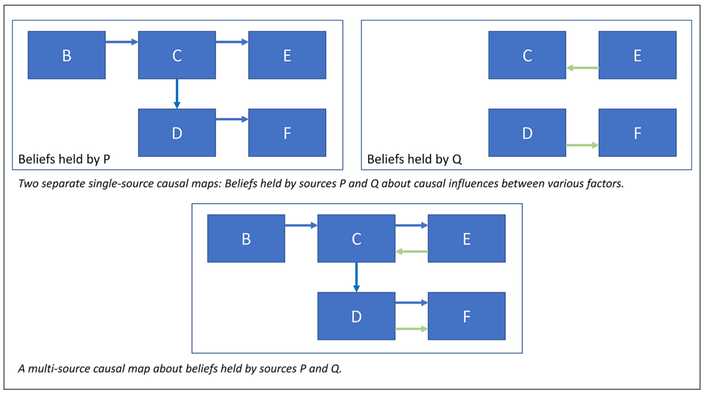
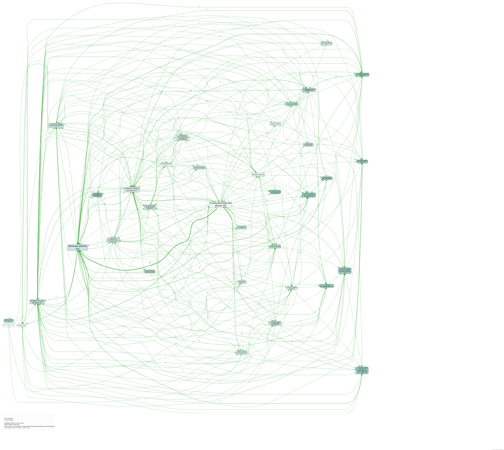
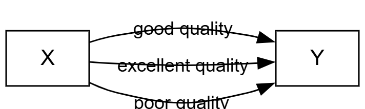
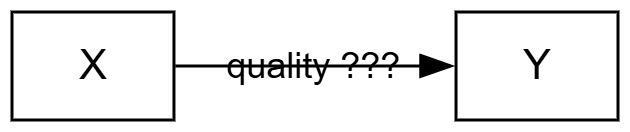
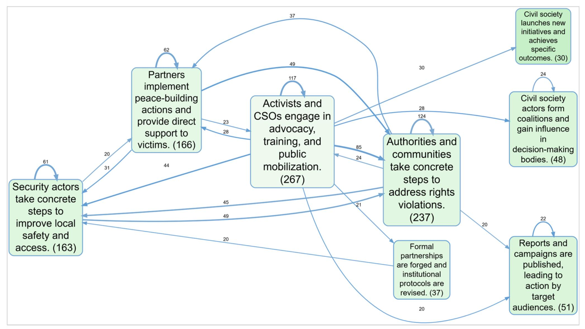
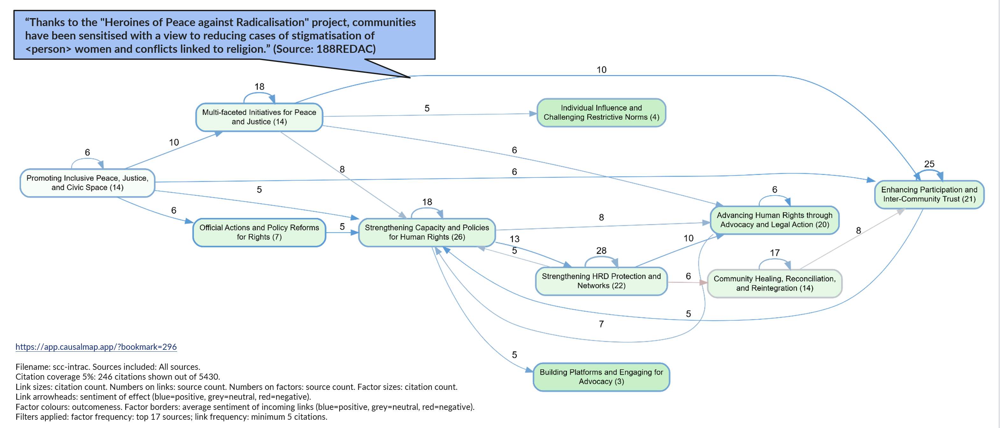
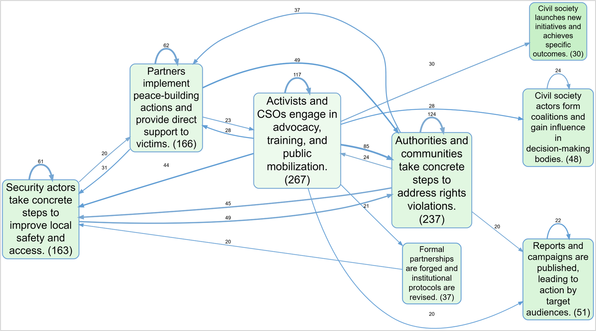
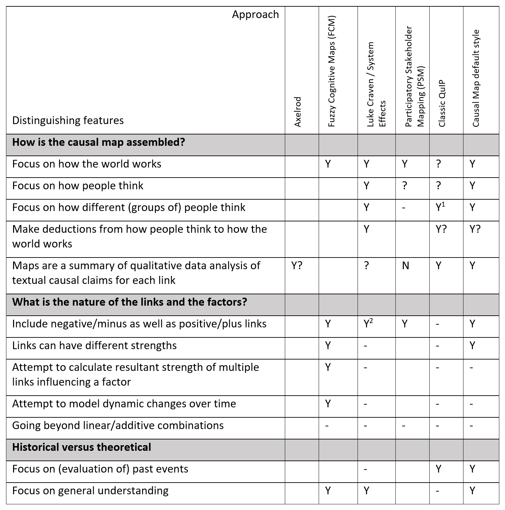

---
# revealjs only auto-emits a title slide when `title` is set (template $if(title)$).
pagetitle: "Causal mapping is not systems dynamics"
author: "Steve Powell, Causal Map Ltd"
date: "21 May 2026"
format:
  revealjs:
    theme: simple
    slide-number: true
    transition-speed: slow
    incremental: false
    footer: "Amsterdam UMC Systems Science SIG · 21 May 2026"
    width: 1280
    height: 720
    fig-cap-location: bottom
    include-in-header:
      - ../_shared/preview-bridge.html
    css:
      - ../_shared/styles.css
      - ../fontawesome/css/all.min.css
---

# {.center .title-page background-color="#1b1b3a"}

::: {.eyebrow}
Amsterdam UMC Systems Science SIG · 21 May 2026 · 09:30 CET
:::

::: {.headline}
Causal mapping is [not systems dynamics]{.teal}
:::

::: {.subhead}
Coding what people say, then deciding what it means
:::

::: {.byline}
Steve Powell · Causal Map Ltd · hello@causalmap.app
:::

::: {.urls}
app.causalmap.app · free, unlimited public projects · garden.causalmap.app
:::

## Causal mapping and the Causal Map app

:::: {.columns}
::: {.column width="50%"}
Causal mapping is a 50-year tradition used in many disciplines including cognitive psychology, ecology, decision science, management and evaluation.

Causal Map Ltd provides the Causal Map app for evaluation and qualitative research.

Its niche: coding causal claims in text, closer to CAQDAS/NVivo than to a diagramming tool.

:::

::: {.column width="50%"}
**The app**: [app.causalmap.app](https://app.causalmap.app). Free for unlimited *public* projects!

::: {.tiles}
- **Source-aware coding** &nbsp; every link can be traced back to quote from source text
- **Manual or AI-assisted coding** &nbsp; AI coding is a great fit
- **Interactive maps** &nbsp; filter, zoom, recode on the fly
:::
:::
::::

## Causal mapping and systems dynamics: shared ground

Boxes and arrows are a shared visual language.

Feedback, mediation and indirect effects matter in many traditions.

The common move: messy reality into useful structure.

[The interesting question is what the arrows mean.]{.accent}

## What does an arrow mean?

:::: {.columns}
::: {.column width="50%"}
::: {.panel .panel-blue}
**Reading 1: a fact about the world**

*If X goes up, Y goes up.*

A claim about the system itself. Backed by measurement, modelling, simulation.
:::

[→ System dynamics, CLDs, FCMs]{.arrow-blue}
:::

::: {.column width="50%"}
::: {.panel .panel-green}
**Reading 2: a claim with a source**

*"This person said X influenced Y, in this context, in this quote."*

A claim about somebody's account of the world. Backed by quoting them.
:::

[→ Causal Map]{.arrow-green}
:::
::::

::: {.note}
Many mapping traditions slide between the two. This deck keeps them apart, then bridges them.
:::

## Stakeholder cognitions first

:::: {.columns}
::: {.column width="50%"}
In this text-coding tradition, a causal map first records *what people say causes what*.

- Each link belongs to a quote, a source, a context
- Aggregating across sources is a deliberate *later* step
- The map shows stakeholder thinking, not the shape of the world

A CLD is usually a hypothesis about the system. This map shows the *distribution of claims across people*.
:::

::: {.column width="50%"}
{width=100%}

[P and Q's separate beliefs, then combined. Each link still carries source metadata.]{.caption}
:::
::::

## Minimalist coding: factors are propositions, not variables

:::: {.columns}
::: {.column width="50%"}
A factor is a short proposition, close to what someone said.

::: {.examples}
**Examples**

"Not enough money in the household"

"Did not take a holiday this year"

"Civil society coalitions gained influence in decision-making bodies"
:::

Not *"money"* as a variable from low to high.
:::

::: {.column width="50%"}
*What this minimalist style does not code on the link itself:*

- necessity or sufficiency
- non-linearity or polarity
- mediator, moderator, inhibitor roles
- strength or effect size

::: {.note}
People rarely state these explicitly. Coders rarely agree on them from text. Minimalism is honesty about what the data can support.
:::
:::
::::

## Why minimalism scales

:::: {.columns}
::: {.column width="50%"}
Bare links plus good labels let analysts:

- aggregate across sources without arguing about what symbols mean
- compare across groups, sites, projects
- summarise with simple counts (citations, sources)
- code thousands of claims at workable speed

[It works fully by hand.]{.accent} AI makes it faster at scale.
:::

::: {.column width="50%"}
{width=100%}
:::
::::

## Hierarchical coding: keep detail, show the big picture

:::: {.columns}
::: {.column width="50%"}
Hierarchical labels let a dense map zoom out without deleting detail.

::: {.panel .panel-teal}
**Convention**

`General; specific`

`New intervention; midwife training`

`Healthy behaviour; hand washing`
:::

Zoom to level 1:

`New intervention -> Healthy behaviour`
:::

::: {.column width="50%"}
::: {.tiles}
- **Keep detail** &nbsp; Quotes stay attached to specific factors
- **Report clearly** &nbsp; Roll up to level 1 or 2 for slides
- **Search better** &nbsp; Parent labels find children
- **Count at the right level** &nbsp; Broad family counts without losing sub-items
:::

::: {.note}
Use a hierarchy only when the parent is a valid causal factor. `A; B` means B can be reported as evidence for A.
:::
:::
::::

## Opposites, polarity and sentiment

:::: {.columns}
::: {.column width="50%"}
Opposites coding handles pairs like:

- `Employed` and `~Employed`
- `Good health` and `~Good health`
- `Eating vegetables` and `~Eating vegetables`

The `~` marks the opposite pole. Combining opposites rewrites both poles to one canonical label, while keeping polarity metadata.
:::

::: {.column width="50%"}
::: {.panel .panel-green}
**Why not just plus/minus links?**

A link can be flipped at the cause end, the effect end, or both. Treating this as one average positive or negative strength loses information.
:::

::: {.panel .panel-blue}
**Sentiment is different**

Sentiment is link metadata, usually `-1`, `0`, `1`. It says whether the claim is positive, neutral or negative in context. It is not the same as an opposite-coded factor.
:::

::: {.note}
Opposites preserve meaning across labels. Sentiment marks the tone or valence of a particular claim.
:::
:::
::::

## The Janus face {.center}

:::: {.columns}
::: {.column width="50%"}
::: {.panel .panel-blue .panel-center}
**Stakeholder cognitions**

What people *think* causes what. The map as a record of distributed belief.
:::
:::

::: {.column width="50%"}
::: {.panel .panel-teal .panel-center}
**Facts about the world**

What *really* influences what. The map as the start of an argument.
:::
:::
::::

::: {.note}
Causal mapping has often muddled these two functions. The important move is to keep the leap *visible* and *separate*.
:::

## Seven moments for quality assurance

Moving from claims to conclusions is a sequence of checks. Only the last is required; most projects use several.

::: {.qa-grid}
1. **Managing the codebook**: zero codebook, fixed codebook or somewhere in between; revisit as coding proceeds.
2. **Coding individual claims**: identify causal claims and keep them close to source wording.
3. **Checking individual claims**: reject hallucinated, hypothetical, reversed or over-interpreted links.
4. **Moving from claims to bundles**: group all X→Y claims; decide whether to create one assessed link.
5. **From bundles to pathways**: check whether links form coherent paths, especially source-traced paths.
6. **Judging value and relative contribution**: ask whether the pathway matters and how contribution compares with alternatives.
7. **Holistic judgements, the whole thing**: does the account hang together well enough to use?
:::

## Moment 1: managing the codebook

:::: {.columns}
::: {.column width="50%"}
Coding rarely sits inside a fixed codebook from the start.

::: {.tiles}
- **Zero codebook** &nbsp; Free-code whatever the sources say; let factors emerge
- **Fixed codebook** &nbsp; Pre-set factors, e.g. tied to a theory of change
- **Hybrid** &nbsp; Start free, then consolidate; or start fixed, then extend
:::
:::

::: {.column width="50%"}
Revisit the codebook as coding proceeds. Merge near-duplicates, split overloaded factors, lift to a useful level of abstraction.

::: {.note}
Not a one-off setup step. Codebook decisions shape every later moment.
:::

Quality questions: are factors at a consistent grain? Do labels mean the same thing across sources? Have AI-coded factors drifted from the intended vocabulary?
:::
::::

## Moment 2: coding individual claims

:::: {.columns}
::: {.column width="50%"}
Code the smallest defensible claim: *this source says X influenced Y*.

::: {.tiles}
- **Cause** &nbsp; Short proposition, close to the text
- **Effect** &nbsp; Short proposition, close to the text
- **Quote** &nbsp; Original passage supporting the link
- **Source** &nbsp; Who or what document the claim came from
:::
:::

::: {.column width="50%"}
First quality move: keep the unit small, traceable and inspectable.

::: {.note}
This is why minimalist coding matters. Richer causal language belongs later, not in the raw link.
:::

Manual or AI, the check is the same: is there a causal claim here, and are the endpoints right?
:::
::::

## Moment 3: checking individual claims

:::: {.columns}
::: {.column width="50%"}
Check each raw claim before it feeds the map.

::: {.tiles}
- **Real causal claim** &nbsp; Not just association, chronology or topic similarity
- **Correct direction** &nbsp; X influences Y, not Y influences X
- **Grounded endpoints** &nbsp; Factor labels match what the source said
- **Not hypothetical** &nbsp; Separate speculation from reported evidence
:::
:::

::: {.column width="50%"}
Mark what matters: tags, conviction, source reliability, custom columns.

::: {.note}
First rule: *don't hide doubt.* Mark it.
:::

These link-level checks flow into filters and bundle summaries downstream.
:::
::::

## Moment 4: moving from claims to bundles

:::: {.columns}
::: {.column width="55%"}
A *bundle* is all claims X→Y across all sources. Either collapse it into one *assessed link*, or skip it if evidence is too thin.

The workflow:

1. Finish coding; fix on the bundles that survive your filters
2. For each bundle: read the quotes, apply your rubric, judge quality
3. Create one assessed link (e.g. confidence 1-5), or none
4. Switch the view: unassessed claims stay in the database; the assessed map is what you argue from

*The app requires a written rubric before assessed links.* Deliberately.

[Typical scale: 1,000 raw claims → 30 bundles → 25 assessed links]{.accent}
:::

::: {.column width="45%"}
{width=100%}

[Unassessed view: many raw claims per bundle]{.caption}

{width=100%}

[Assessed view: one vouched link per bundle]{.caption}
:::
::::

## Moment 5: from bundles to pathways

:::: {.columns}
::: {.column width="50%"}
A→B plus B→C does *not* automatically mean A→C. Contexts may not line up.

::: {.panel .panel-blue}
**Path tracing**: keeps links lying on *some* path from A to C.
:::

::: {.panel .panel-green}
**Source tracing**: keeps only sources whose *own account* runs all the way from A to C.
:::

{width=80%}
:::

::: {.column width="50%"}
::: {.note}
The transitivity trap: fragments from different sources can create a pathway nobody actually told.
:::

Source tracing asks: *did anyone tell the whole story from intervention to outcome?*
:::
::::

## Moment 6: judging value and relative contribution

:::: {.columns}
::: {.column width="50%"}
Once a pathway is credible, ask:

- Did this pathway matter?
- Was the contribution large enough to care about?
- How does it compare with alternative explanations?
- Did it produce valuable, harmful or ambiguous consequences?
:::

::: {.column width="50%"}
::: {.note}
This moves from "is there evidence?" to "what should be concluded?"
:::

Counts and maps help. The analyst weighs significance, context and rivals.
:::
::::

## Moment 7: holistic judgement, the whole thing

:::: {.columns}
::: {.column width="40%"}
The final judgement is about the whole account.

::: {.tiles}
- **Coherence** &nbsp; Does the story hang together?
- **Coverage** &nbsp; What is missing?
- **Robustness** &nbsp; Would doubt change it?
- **Usefulness** &nbsp; Good enough for the decision?
:::

::: {.quote}
Having looked across claims, bundles, pathways, gaps and rivals: is this worth standing behind?
:::

A vignette can draft this whole-map judgement. You check it.
:::

::: {.column width="60%"}
::: {.panel .panel-green}
**Example vignette output**

Based on the data, the quotes provided by individual sources largely represent coherent causal stories explaining the journey from increased knowledge to food consumption quantity.

**Knowledge leading to production and consumption**

One source links lessons from the organisation to increased output, then links that output to better household food consumption.

> "I now produce a lot and I have a good income from my products. I now produce and sell and grow well."
>
> *- MNX-6*
:::
:::
::::

## Case study: INTRAC, SCC programme

:::: {.columns}
::: {.column width="42%"}
[**13** countries]{.stat .stat-green} &nbsp; [**692** outcomes]{.stat .stat-blue} &nbsp; [**5,430** claims]{.stat .stat-teal}

INTRAC was MEL partner for a 13-country civil-society programme. Outcome Harvesting gave rich data, but not the big picture.

::: {.quote}
Couldn't understand the big picture, for the whole programme but also for specific countries too.

*- Alastair Spray, INTRAC*
:::

Zero-shot AI coding: no pre-set codebook. Outputs: one programme map, 13 country maps, filtered views by objective and time period.
:::

::: {.column width="58%"}
{width=100%}
:::
::::

## INTRAC: same data, one country

:::: {.columns}
::: {.column width="50%"}
{width=100%}
:::

::: {.column width="50%"}
**Burkina Faso, country view**

Same database, filtered to Burkina Faso.

Advocacy, training and public mobilisation feed action on rights violations.

Factor and link sizes = citation counts. Arrowhead colour = sentiment (blue positive, red negative).

Every link traces to a quote. Nothing in the visual is inferred.
:::
::::

## The other half of the workflow: questions

:::: {.columns}
::: {.column width="42%"}
Coding is half the job. The database under the map is for questions.

Stack filters and you can answer most evaluation questions worth asking.

::: {.note}
The map you see is one view. Behind it sits a queryable database of links, sources, quotes, tags and metadata.
:::
:::

::: {.column width="58%"}
::: {.panel .panel-blue}
**About factors**

- level in coding hierarchy
- citation / source counts
- upstream / downstream of a chosen factor
:::

::: {.panel .panel-green}
**About links**

- tags, custom columns
- direction, sentiment, time reference
- assessed vs unassessed
:::

::: {.panel .panel-teal}
**About sources**

- role, region, programme arm
- any source-level metadata you bring in
:::
:::
::::

## Two complementary uses

:::: {.columns}
::: {.column width="50%"}
::: {.panel .panel-blue}
**Raw cognition maps**

For policy design, behaviour change and stakeholder analysis: what do people think drives what?

[The map is the answer.]{.emph-blue}
:::

::: {.panel .panel-green}
**Assessed maps**

For evaluation and theory-of-change checks: which claims are vouched for, and with what behind them?

[The map is the start of an argument.]{.emph-green}
:::
:::

::: {.column width="50%"}
{width=100%}

[INTRAC: pathways from interventions to outcomes in a 13-country lobby and advocacy programme.]{.caption}
:::
::::

## How this sits alongside neighbouring methods

:::: {.columns}
::: {.column width="33%"}
::: {.panel .panel-blue}
**System dynamics, CLDs, FCMs**

- arrows = facts about the world
- nodes = variables
- single composite model
- strong on simulation, leverage points
- quantitative / semi-quantitative
:::
:::

::: {.column width="33%"}
::: {.panel .panel-green}
**Text-coded causal mapping**

- arrows = claims with a source
- factors = propositions
- many sources, traceable
- strong on scaling qualitative evidence
- works with messy open-ended text
:::
:::

::: {.column width="33%"}
::: {.panel .panel-grey}
**Also distinct from**

**CAQDAS**: text tags, no map structure

**System Dynamics Bot**: variable-based, single model

**FCM**: often predictive in practice
:::
:::
::::

[Comparison table adapted from Powell, Copestake and Remnant 2024]{.source-credit}

## The methods landscape in full

{width=92% fig-align="center"}

## Causal mapping and AI: a good fit

:::: {.columns}
::: {.column width="50%"}
*The method works fully without AI.* Minimalist coding is a small, clear task, which suits LLMs.

Validation study (Powell and Cabral, 2025), QuIP corpus, GPT-4 temperature 0:

::: {.metric-row}
::: {.metric}
[84%]{.metric-num}

[Open coding 180 links]{.metric-label}
:::

::: {.metric}
[87%]{.metric-num}

[Codebook-assisted 172 links]{.metric-label}
:::
:::

Composite score: correct endpoints, real causal claim, not hypothetical, correct direction.
:::

::: {.column width="50%"}
Top-level overview maps from AI and human coding come out broadly the same.

It works because the prompt is narrow: "where is a causal claim, and what influences what?"

::: {.note}
**INTRAC:** 5,430 claims from 692 harvested outcomes and ToC review documents. Zero-shot (Gemini 2.5 Pro). Coded in days, not months.
:::
:::
::::

## Three things to take away {.center}

:::: {.columns}
::: {.column width="33%"}
::: {.takeaway}
**1**

**The arrow question matters**

The choice between 'arrows are facts' and 'arrows are claims' is not cosmetic. This deck starts with claims.
:::
:::

::: {.column width="33%"}
::: {.takeaway}
**2**

**Minimalism enables scale**

Minimalist coding lets analysts aggregate, compare and query thousands of claims without semantic disputes.
:::
:::

::: {.column width="33%"}
::: {.takeaway}
**3**

**The bridge needs a workflow**

Going from claims to facts needs explicit, checkable steps. Not an algorithm.
:::
:::
::::

# Resources {background-color="#1b1b3a" .center}

:::: {.columns}
::: {.column width="50%"}
::: {.resources-col}
**App (free, unlimited public projects)** 
[app.causalmap.app](https://app.causalmap.app)

**Knowledge garden** 
[garden.causalmap.app](https://garden.causalmap.app)

**Methods comparison table** 
[in Powell, Copestake and Remnant 2024]{.ref}
:::
:::

::: {.column width="50%"}
::: {.resources-col}
Powell and Cabral (2025) AI-assisted causal mapping: a validation study. *IJSRM.*

Powell, Cabral and Mishan (2025) A workflow for collecting and understanding stories at scale. *Evaluation.*

Powell, Copestake and Remnant (2024) Causal mapping for evaluators. *Evaluation*.
:::
:::
::::

::: {.thank-you}
Thank you. Questions, please.
:::

::: {.contact}
hello@causalmap.app
:::

