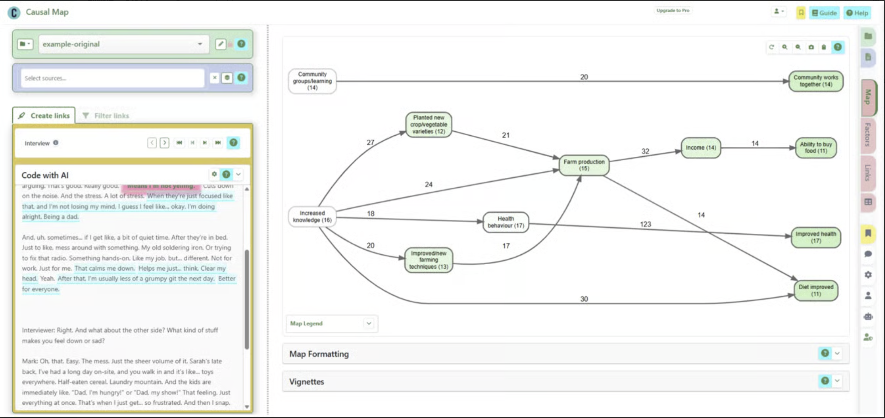

## Cover {.cover .no-title background-color="#0E3D5F"}

{.brand-cm}

::: {.kicker}
04-06-2026
:::

::: {.cover-title}
How to build a real-life theory of change from your interviews using AI: a Causal Map 4 training session
:::

## The team {.content background-color="#ffffff"}

{.brand-qualia}

::: {.body}
- Steve Powell, Co-founder and Director, Causal Map Ltd
- Gabriele Caldas Cabral, Outreach Coordinator, Causal Map Ltd
:::

## Overview {.content background-color="#ffffff"}

{.brand-qualia}

::: {.body}
- What is QualiaInterviews?
- Servers inside and outside the EU
- Being interviewed by Qualia
- Why AI-led interviews?
- QualiaInterviews demonstration
- Discussion
- Questions and answers

:::

## Why AI-led interviews? {.section .no-title background-color="#0E3D5F"}

::: {.section-title}
Why AI-led interviews?
:::

{.brand-qualia}

## Servers inside and outside the EU {.content background-color="#ffffff"}

{.brand-qualia}

::: {.body}
- **EU-only mode** [YES]{.chip-yes}: data and processing stay entirely inside the EU
- **Session persistence:** the toggle setting holds between sessions
- **Real time:** the page reloads to reconnect to the right services
- **Global mode** [NO]{.chip-no}: flexible storage on the wider base in the US
:::

::: {.callout}
Important to know: the two environments are fully separate. No data, interviews or credits transfer between modes.
:::

## Servers inside and outside the EU {.content background-color="#ffffff"}

{.brand-qualia}

::: {.body}
- **EU-only mode** [YES]{.chip-yes}: data and processing stay entirely inside the EU
- **Session persistence:** the toggle setting holds between sessions
- **Real time:** the page reloads to reconnect to the right services
- **Global mode** [NO]{.chip-no}: flexible storage on the wider base in the US
:::

::: {.callout}
Important to know: the two environments are fully separate. No data, interviews or credits transfer between modes.
:::

## Case studies {.content background-color="#ffffff"}

{.brand-qualia}

::: {.body}
- **VIB, Brussels:** 100 HR interviews on career trajectories
- **Sudan:** 60 development professionals for a programme evaluation
- **Gender gap in STEM, Chile:** automated interviews with 32 participants
- **UK postdoc feedback:** mid-career drivers and obstacles to learning
- **Climate adaptation, Austria:** 38 harvested outcome statements
:::

## Interview about XXX {.content background-color="#ffffff"}

{.brand-qualia}

::: {.body}
INTERVIEW LINK + QR CODE

{width="20%"}
:::

## Obrigada! {.closing .no-title background-color="#0E3D5F"}

::: {.gei-logo}

::: {}
global <b>evaluation</b> initiative
:::
:::

::: {.closing-title}
Obrigada!
:::
