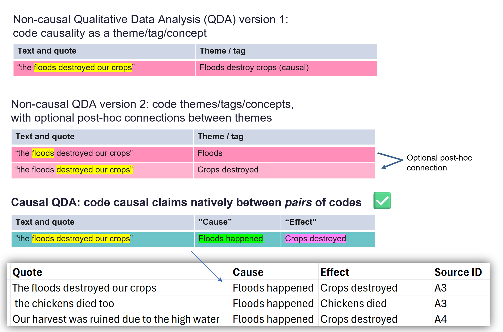
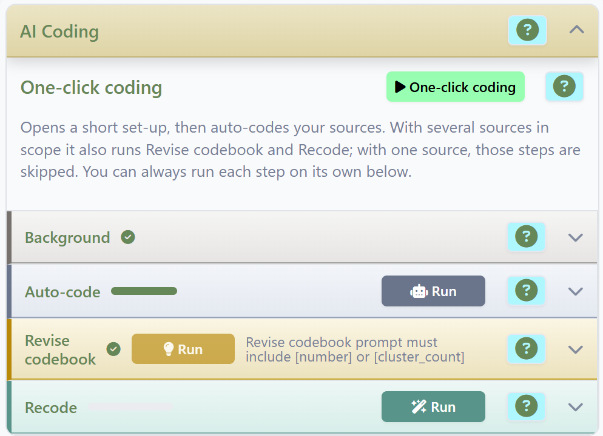

# Cover {.cover .no-title background-color="#0E3D5F"}

{.brand-cm}

::: {.kicker}
04-06-2026
:::

::: {.cover-title}
How to build a real-life theory of change from your interviews using AI:

a Causal Map 4 training session
:::

## The team {.content background-color="#ffffff"}

::: {.body}

:::: {.columns}
::: {.column width="50%"}
Steve Powell, Co-founder and Director, Causal Map Ltd

{width="40%"}
:::
::: {.column width="50%"}
Gabriele Caldas Cabral, Outreach Coordinator, Causal Map Ltd

.png){width="40%"}
:::
::::

What we will do today: gather interviews with AI, turn them into a theory of change, and learn to question it. About 90 minutes, with plenty of room for your questions.

:::

# You have a stack of interviews {.section .no-title background-color="#0E3D5F"}

::: {.section-title}
You have a stack of interviews
:::

{.brand-cm}

## Somewhere in there is your answer {.content background-color="#ffffff"}

::: {.body}

Interviews. Reports. Open survey answers. Pages of people telling you what changed and why.

Somewhere in there is the answer to your question. How do you get it out, in a way you can stand behind?

:::

## Two tempting shortcuts, both bad {.content background-color="#ffffff"}

::: {.body}

**Hand it to the black box.** "ChatGPT, what does this say?" Fast and fluent, but you cannot see what it leaned on, so you cannot defend the answer.

**Read it all yourself.** Thorough, but it does not scale. Three hundred transcripts, and you still have to show your synthesis really reflects what people said.

There is a better way.

:::

## The plan for today {.content background-color="#ffffff"}

::: {.body}

One route from your interviews to a theory of change you can defend:

- start from interviews, reports, open answers, any narrative data
- turn what people said into a map of causes and effects, with AI
- question that map until you have an answer

AI does the patient clerical work. You make the judgements.

:::

# Why causal mapping {.section .no-title background-color="#0E3D5F"}

::: {.section-title}
Why causal mapping
:::

{.brand-cm}

## What we do {.content background-color="#ffffff"}

::: {.body}

You read the text and mark each causal claim as a link from one factor to another.

> "The training gave me confidence, and that is why I started the business."

This becomes **training → confidence → started a business**, keeping the exact quote and the source on every link.

Do that across all your interviews and the links join up into a map: your theory of change, built from what people actually said.

:::

## coding {background-color="#ffffff" .content .no-title}

{width="70%"}

## We code claims, not facts {.content background-color="#ffffff"}

::: {.body}

A link means: this person says X influenced Y. Not that X really did.

Twenty people saying so is not proof. It is evidence you can now weigh. Turning that evidence into a conclusion is your job, and we come back to it later.

:::

## Keep it simple {.content background-color="#ffffff"}

::: {.body}

We do not code how strong the link was, or whether it was good or bad, or what the hidden meaning might be.

People say "X made Y happen". They rarely say how strongly. So we do not invent it. Simple coding stays close to what people said, and that is exactly why AI can do it.

:::

# Why use AI for causal mapping {.section .no-title background-color="#0E3D5F"}

::: {.section-title}
Why use AI for causal mapping
:::

{.brand-cm}

## AI as a clerk, not an oracle {.content background-color="#ffffff"}

::: {.body}

**The clerk's job:** find every causal claim, attach a quote. Tireless, exhaustive, cheap.

**Your job:** decide the question, check the work, judge what it all means.

The clerical task is simple enough to hand over. The judgement is not, so you keep it.

{width="80%"}

:::

## Built for scale {.content background-color="#ffffff"}

::: {.body}

A team reading by hand tires, gets bored, and pays uneven attention. The AI does not.

It codes every claim across hundreds of documents, and each one traces back to the sentence it came from. So you capture everything cheaply, then spend that volume down into a conclusion you can defend.

{width="70%"}

:::

## Case studies {.content background-color="#ffffff"}

::: {.body}
- **VIB, Brussels:** 100 HR interviews on career trajectories
- **Sudan:** 60 development professionals for a programme evaluation
- **Gender gap in STEM, Chile:** 32 student interviews
- **UK postdoc feedback:** mid-career drivers and obstacles to learning
- **Climate adaptation, Austria:** 38 harvested outcome statements
:::

## Chile: gender gaps in STEM {.no-title background-image="../_shared/img/screenshot-duoc-uc-evaluating-gender-equity-in-stem-with-ai-driven-interviews-2.png" background-size="contain" background-color="#ffffff"}

::: {.shot-cap}
DuocUC, Chile. 32 student interviews about gender in STEM, coded by AI into 251 links, with sentiment marked: blue for positive, red for negative.
:::

## INTRAC: one map across 13 countries {.no-title background-image="../_shared/img/intrac-map.png" background-size="contain" background-color="#ffffff"}

::: {.shot-cap}
INTRAC needed the big picture from a programme across 13 countries. The AI coded 5,430 causal claims into an overall map and one per country, and drafted the written analysis as a vignette.
:::

# The workflow, three steps {.section .no-title background-color="#0E3D5F"}

::: {.section-title}
The workflow, three steps
:::

{.brand-cm}

## Step 1: Start from the question {.content background-color="#ffffff"}

::: {.body}

Before you touch the data, write down what you want to be able to say at the end, and to whom.

Every later choice follows from that one sentence: the data you gather, the labels you use, the maps you make.

:::

## Be realistic about what it can answer {.content background-color="#ffffff"}

::: {.body}

:::: {.columns}
::: {.column width="50%"}
**Good at**

- which factors matter most
- what drives or follows from a factor
- how groups differ
- whether the evidence fits your theory of change
:::
::: {.column width="50%"}
**Not for**

- effect sizes
- proving X causes Y on its own
:::
::::

Pick questions the method can serve.

:::

## Step 2: Code the claims {.content background-color="#ffffff"}

::: {.body}

You write a short instruction for the AI, like a chatbot prompt, and it codes the links for you.

The golden rule: test on a small, varied sample, see exactly where the output is wrong or thin, fix the instruction, then scale up.

And one rule you never break: **every link needs a quote.** Without it you cannot show your working.

:::

## Step 3: Check the links {.content background-color="#ffffff"}

::: {.body}

However careful the coding, some links will be wrong. Check them before you analyse.

- tag the doubtful or surprising ones, to filter later
- note how sure each source sounds
- note how reliable each source is

A quick read of a varied sample catches most problems.

:::

# Your map is a theory of change you can question {.section .no-title background-color="#0E3D5F"}

::: {.section-title}
Your map is a theory of change you can question
:::

{.brand-cm}

## A filter is a question {.content background-color="#ffffff"}

::: {.body}

Your links are not a static report. They are a living map you can question, over and over.

You ask a question by filtering. Women only. Everything downstream of training. Stack the filters and you answer a bigger question. The same data gives very different maps, each one just the result of a different question.

:::

## Two everyday examples {.content background-color="#ffffff"}

::: {.body}

**"What did the cash transfer lead to?"** Filter to that factor, look downstream. Out comes a map of every reported consequence, with counts.

**"Do women and men tell different stories?"** Split the same map by group. The links each group stresses light up differently.

:::

## The transitivity trap {.content background-color="#ffffff"}

::: {.body}

A pig farmer says the cash grant gave them **more cash**. A wheat farmer says **more cash** let them buy **more seed**.

So cash grants lead to more seed? **No.** Two people, two stories, stitched into one that nobody told.

The safe move: keep only the sources whose own account runs all the way through.

:::

## Step back and judge {.content background-color="#ffffff"}

::: {.body}

Behind one tidy map there may still be hundreds of quotes. Does the claim hold up? Do the links really belong to the same context?

The AI can draft a source-by-source commentary on each pathway, doing only what a patient reader could. Treat it as a first draft and edit it.

:::

## Let's build a map, live {.no-title background-iframe="https://app.causalmap.app" background-interactive="true"}

## A coded map of what people said {.no-title background-image="../_shared/img/filtered-map-final.png" background-size="contain" background-color="#ffffff"}

::: {.shot-cap}
Every box is a factor, every arrow a claimed influence, and behind each arrow is the quote it came from.
:::

## The same map, split by group {.no-title background-image="../_shared/img/map-group-differences-shown-on-map.png" background-size="contain" background-color="#ffffff"}

::: {.shot-cap}
The same data, one question added: how do the groups differ? The links each group stresses light up differently.
:::

# A real evaluation: the Love Alliance {.section .no-title background-color="#0E3D5F"}

::: {.section-title}
A real evaluation: the Love Alliance
:::

{.brand-cm}

## What the programme planned {.no-title background-image="../_shared/img/map-love-alliance-theory-of-change.png" background-size="contain" background-color="#ffffff"}

::: {.shot-cap}
The official theory of change: a tidy ladder from strategies up to goals. Clear, communicable, fundable. But a ladder cannot draw a loop.
:::

## Too much evidence, the nicer problem {.content background-color="#ffffff"}

::: {.body}

An end-term evaluation across ten African countries, with Southern Hemisphere. We coded the narrative data for them.

- 176 documents: 79 country reports, 97 interview transcripts
- over 22,000 causal claims, coded by AI
- 13,756 kept for the maps

No team could hand-code that and stay fresh. Every link still carries the quote it came from.

:::

## What people actually said {.no-title background-image="../_shared/img/map-love-alliance-overall.png" background-size="contain" background-color="#ffffff"}

::: {.shot-cap}
A map built from the interviews. The biggest factor, Love Alliance support for advocacy and capacity building, was cited 777 times. The story people told was "we built each other up", which no ladder predicted.
:::

## Loops a ladder cannot draw {.no-title background-image="../_shared/img/map-love-alliance-movement-building.png" background-size="contain" background-color="#ffffff"}

::: {.shot-cap}
The movement-building view. Networking is the hub, with reinforcing circles: capacity feeds peer support feeds capacity; networking enables advocacy which feeds more networking.
:::

## Put a doubt to the data {.content background-color="#ffffff"}

::: {.body}

Partway through, a fair worry surfaced: was the programme's advocacy provoking a backlash against key populations?

Rather than trade impressions, we put the question to the data and traced it through the 43 sources that raised it. Every account pointed the other way: the support helped communities resist backlash, none named it as the cause.

> "also helping to counter the backlash against women's rights and LGBT rights"

:::

# So what {.section .no-title background-color="#0E3D5F"}

::: {.section-title}
So what
:::

{.brand-cm}

## The whole thing in one line {.content background-color="#ffffff"}

::: {.body}

Code "X influenced Y, with a quote". Capture everything, capture cheaply, let AI do it. Then judge, in the open.

This is not statistical proof. It is a disciplined way to assemble evidence, weigh it transparently, and reach a conclusion you can stand behind.

:::

## Need the data first? {.content background-color="#ffffff"}

{.brand-qualia}

::: {.body}

No interviews yet? Qualia can gather them. It runs a chat interview that asks people what changed and why, follows up in their own words, in any language.

The answers come back as narrative text, ready to code into a map.

:::

## Come and try it {.content background-color="#ffffff"}

::: {.body}

This is how we work at Causal Map Ltd, every day.

If you want to go from a stack of interviews to a theory of change you can defend, come and try it with us at **app.causalmap.app**.

:::

## Resources {.content background-color="#ffffff"}

::: {.body .resources}

::: {.thanks}
Thanks. Questions, please. hello@causalmap.app
:::

:::: {.columns}
::: {.column width="50%"}
**App, free for public projects** 
[app.causalmap.app](https://app.causalmap.app)

**Knowledge garden** 
[garden.causalmap.app](https://garden.causalmap.app)
:::
::: {.column width="50%"}
Powell and Cabral (2025) AI-assisted causal mapping: a validation study. *IJSRM.*

Powell, Cabral and Mishan (2025) A workflow for collecting and understanding stories at scale. *Evaluation.*

Powell, Copestake and Remnant (2024) Causal mapping for evaluators. *Evaluation.*
:::
::::

:::
