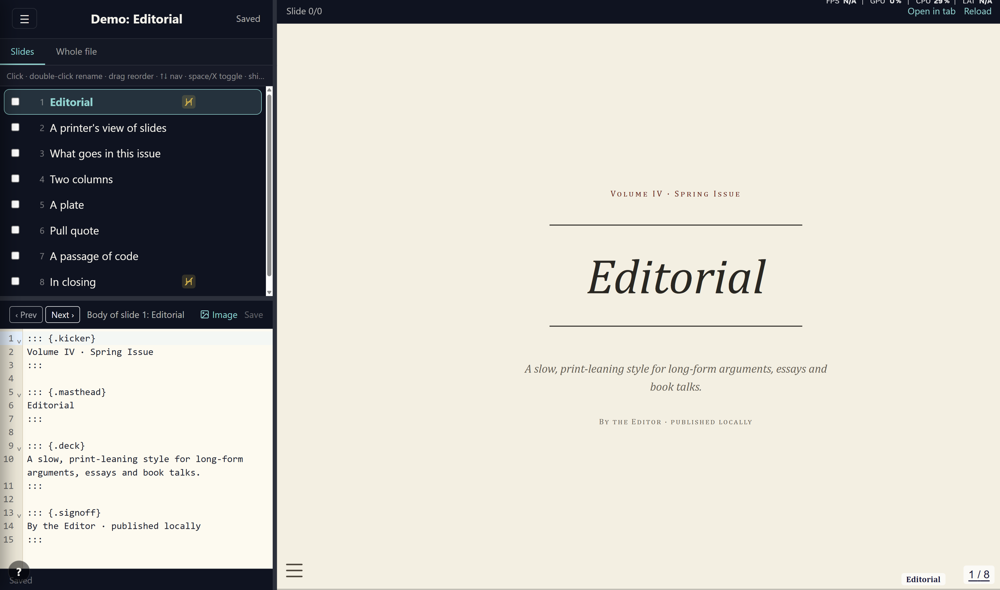
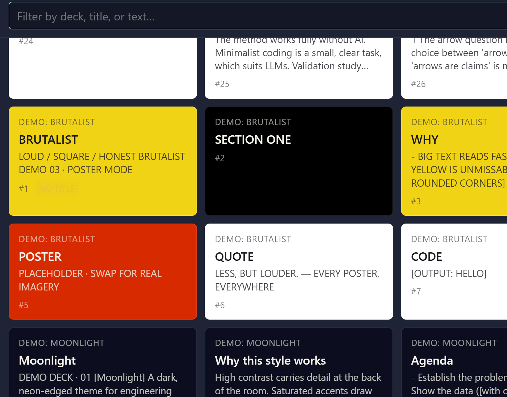
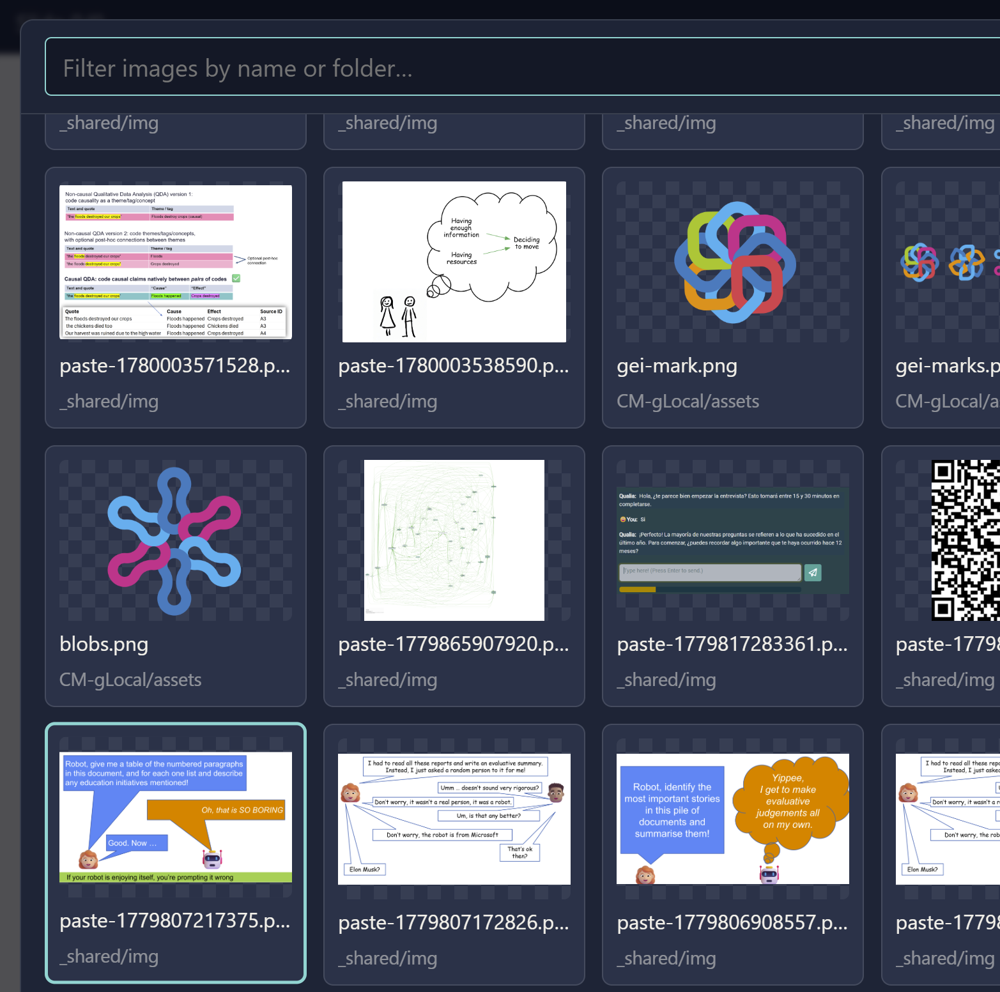
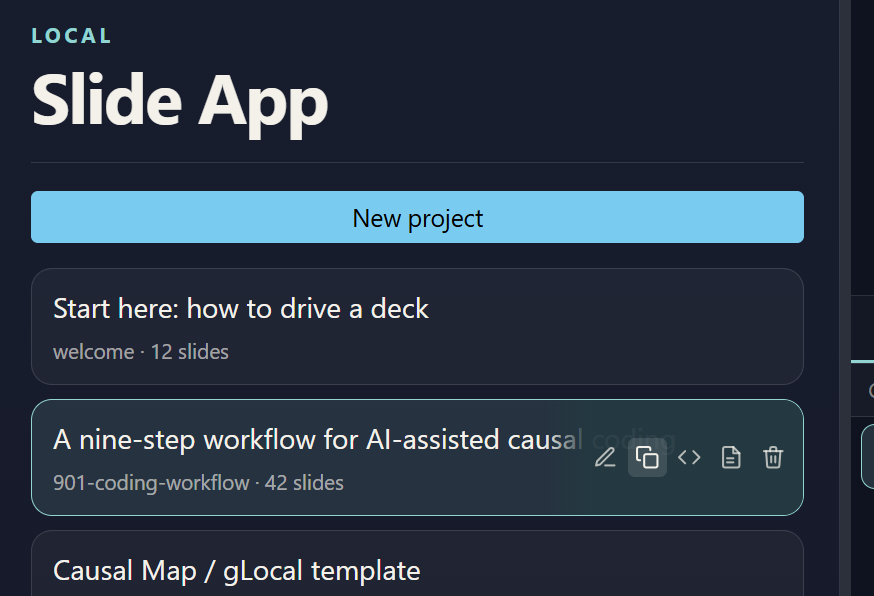
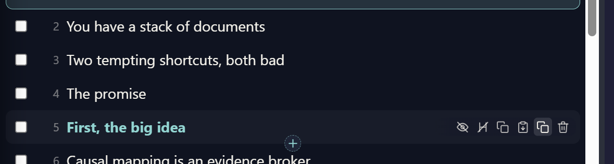

# Slide App

A simple app for you, and optionally your AI assistant, to make consistent, powerful, beautiful slideshows.



## Why

Most slide tools keep each deck in a binary file. Styling drifts from one deck to the next, reusing a slide means copy, paste and reformat by hand, and an AI assistant cannot read or write the deck for you.

Here every deck is plain text: a [Quarto](https://quarto.org) Markdown file (`.qmd`) plus its CSS and images, in a folder on your computer. There is no database; those files are the source of truth. That one choice is what makes decks consistent (they share styles), reusable (lift a slide or image from any other deck), and easy for an assistant to draft for you, and it keeps them yours to render to HTML or PDF with no lock-in. You edit in a three-pane app, deck list and slides on the left, the slide body in the middle, a live [reveal.js](https://revealjs.com) preview on the right, or in any text editor.

## Features

- **Build consistent decks.** Shared styles and project-wide RevealJS defaults keep every deck looking the same, and any deck can override them.
- **Reuse slides and images across decks.** Pick a slide from another deck and either keep its original look or adapt it to the current deck's styles. Reuse any image from any deck through a picker.
- **Find a deck fast.** A search box in the rail matches decks by title, filename or slide contents, and the rail keeps the decks you opened most recently at the top.
- **Write in plain text.** Each deck is Markdown, split into slides by headings, so any editor works and nothing is locked in a database.
- **Edit with slash commands.** Type `/` for columns, spans, fenced divs, images, fragments, and speaker notes, with tab-through placeholders.
- **Edit in a capable editor.** CodeMirror brings find and replace, multiple cursors, move and copy lines, class autocomplete drawn from the deck's own CSS, and column-block tinting so the structure is visible in plain text.
- **Preview live with reveal.js.** Speaker notes, a two-dimensional overview grid, incremental reveal, nested rows and columns for any layout, a section breadcrumb, and a progress bar.
- **Navigate both ways.** Selecting a slide moves the preview; moving in the preview selects the slide.
- **Paste images straight into the editor.** They save to a shared folder and insert at the cursor, so copied slides keep working in other decks.
- **Let your AI write the slides.** A deck is just text, so an assistant can draft a whole deck for you and you refine it here. Every deck is a folder of text files on your computer.
- **Render to HTML or PDF.** Produce a single self-contained HTML file, or a PDF, from any deck, and publish public decks read-only to Netlify.
- **Start from a theme.** Several demo decks (brutalist, editorial, moonlight, pastel cards, terminal) show distinct looks you can clone as a starting point.

## Quick start

From the project root (`19c-slides`):

```powershell
npm run install:app   # one time, installs the app's dependencies
npm start             # rebuilds the frontend, then serves on http://127.0.0.1:3210
```

Open http://127.0.0.1:3210, pick a deck on the left, and edit. Press `Ctrl+Enter` or `Ctrl+S` (or click **Save**) to update the preview.

The app itself lives in `app/`; the root `package.json` just forwards these commands into it, so you never need to `cd app`. `npm start` always rebuilds first, so it reflects the current code. Use `npm run serve` to start without rebuilding (faster, serves the last build).

Only run `npm run dev` if you are editing the app's own code: it starts a second server with hot reload on http://127.0.0.1:5173 and proxies data calls to the main server. It is not needed for making slides.

Or work in Quarto directly, from any deck folder:

```powershell
quarto preview slides.qmd
```

Requirements: [Quarto](https://quarto.org/docs/get-started/) and [Node.js](https://nodejs.org). Developed on Windows with PowerShell; the app runs anywhere Node and Quarto do.

The rest of this README covers the details: deck layout, the app's editing model, deck front matter, and building static HTML.

## Features in detail

**Consistent decks, with room to differ.** `_quarto.yml` sets project-wide RevealJS defaults (transition, progress bar) and `_shared/styles.css` holds the styles every deck shares, including the section breadcrumb and the title-page layout. A deck inherits all of this and overrides only what it needs in its own front matter or CSS, so a set of decks looks like a set rather than a pile.

**Reuse slides and images.** The slide gallery lists every slide in every deck. Pick one and choose how its styles travel: keep its original look (the source deck's CSS rules come across, overriding the target where they clash) or adapt it (only missing rules used by that slide are added, so it takes on the target deck's styles). CSS variables the copied rules depend on come across too. A separate image gallery lets you drop any image from any deck into the slide you are editing.





**Find a deck.** The deck rail has a search box that matches your text against each deck's title, folder name and slide contents, so you can jump to a deck by something it says, not just its name. Title and filename matches rank above content-only matches. With the box empty, the rail lists the decks you opened most recently first (then by `order:`, then title), so whatever you are working on stays to hand.

**Plain-text source.** A deck is one `.qmd` file plus its CSS and images in a folder. Slides are separated by Markdown headings: `#` for title or section slides, `##` for normal slides. There is no database and no proprietary format, so you can edit in this app, in Quarto directly, in any text editor, or have an AI assistant generate a deck and then refine it here.

**Slash commands and class autocomplete.** In the body editor, type `/` at the start of a line to insert Quarto structures: `/columns`, `/column`, `/span`, `/div`, `/image`, `/columns3`, `/fragment`, `/notes`. `Tab` jumps between the placeholders. Select text and press `/` to wrap it in a styled span with the class picker already open. Type `.` inside an attribute block to choose from the classes the active deck's CSS actually defines, each tagged shared or deck.

**Live reveal.js preview.** The right pane embeds `quarto preview`, so you get the real reveal.js deck: press `S` for the speaker view with notes, press `Esc` for the overview grid that lays every slide out across and down, reveal content one step at a time with fragments, and nest rows and columns for any layout. A faint breadcrumb shows the current section and a progress bar tracks position. Press `?` in any deck for the full list of keyboard shortcuts. The `welcome` deck walks through all of this.

**Two-way navigation.** The slide list, body editor, and preview stay in step. Selecting a slide jumps the preview to it; arrow keys or the slide menu inside the preview select the matching row. The rendered deck is the source of truth for where each slide sits, so the three panes never drift apart.

**Paste images directly.** Paste an image from the clipboard into the editor and it saves to `_shared/img/` and inserts a reference at the cursor. Because the folder is shared, a slide you copy to another deck keeps its image.

**Render to HTML and PDF.** Build a single self-contained HTML file for any deck (good for email), or a PDF. Mark a deck `public: true` and `build-site.ps1` renders it into `_site/` for read-only hosting on Netlify.

## Deck Layout

Each slideshow is in its own subfolder.

- `Amsterdam-UMC/slides.qmd`
- `cm-features/features-slides.qmd`

Slides are separated by Markdown headings:

- `#` for title or section slides
- `##` for normal slides

This gives the deck a two-dimensional shape. Each `#` starts a new section that runs across, and the `##` slides under it run down. In the running deck, `→` and `←` move between sections, `↓` and `↑` move within one, and `Space` goes through everything in order. Press `Esc` for an overview grid that shows the same layout. The `welcome` deck demonstrates this.

## Quarto Workflow

You can keep using Quarto directly.

From a deck folder:

```powershell
quarto preview slides.qmd
```

Or use the existing batch files:

```powershell
.\Amsterdam-UMC\preview.bat
.\cm-features\preview-features.bat
```


## Local Web App

The app is in `app/`. It edits the same `.qmd` files and embeds `quarto preview` for the live view. Run it from the project root (see Quick start):

```powershell
npm start
```

Open http://127.0.0.1:3210. The layout has three columns:

- **Left**: a search box and the deck list. New project at the top; hover a deck card for rename, clone, build HTML, build PDF and delete.
- **Middle (split)**: slide list on top, body editor for the selected slide on the bottom.
- **Right**: embedded `quarto preview`. It reloads when the `.qmd` is written to disk, which only happens when you render (see below), not on every keystroke.



The slide list supports:

- Click to select (the body editor and preview both jump to that slide)
- Checkbox to multi-select
- Drag to reorder
- Double-click to rename (preserves heading attributes such as `{.hidden-slide}`)
- Hover a row for its actions: hide, copy, duplicate, delete, and more; hover the gap between rows for a `+` to insert a slide
- Right-click for the same actions, applied to a multi-selection



Slide navigation is bidirectional, and the rendered deck is the source of truth for where each slide sits. A small bridge script (`_shared/preview-bridge.html`, injected via `include-in-header`) exchanges `postMessage` events with the parent:

- On load (and after every render) the bridge walks Reveal's own slide collection and posts the real ordered list, each entry with its `(h, v)` and heading text. The app pairs its parsed headings to that list by order, so it never has to reproduce Quarto's layout (auto title slides, merged headings, `slide-level`) and the three panes cannot drift apart.
- Selecting a slide in the rail sends `{type:'goto', h, v}` to the iframe, which calls `Reveal.slide(h, v)`. No reload.
- Navigating inside the iframe (arrow keys, slide menu, links) posts a `slidechanged` event back, and the rail and body editor follow.

A heading the deck does not render (one Quarto merges away, or a hidden slide) simply gets no `(h, v)` and is left unnavigable rather than shifting every slide after it. Initial selection follows whatever the preview shows first, so the rail and the title slide always agree on load.

Editing does not touch disk. The body is spliced into an in-memory copy of the `.qmd` and the slide list re-parses locally, so typing never reloads the preview. To render, press `Ctrl+Enter` (or `Ctrl+S`) or click **Save**: the in-memory `.qmd` is written to disk, Quarto's file watcher reloads the iframe, and the bridge re-attaches and re-sends the current slide. Switching deck renders the deck you are leaving so edits persist; the slide actions (new, delete, move, paste, rename) also write and render.

The body editor (CodeMirror) has two completion helpers, both quiet during ordinary prose:

- Type `/` at the start of a line for slash commands that insert Quarto structures: `/columns`, `/column`, `/span`, `/div`, `/image`, `/columns3`, `/fragment`, `/notes` (everyday ones first). `Tab` jumps between the `${...}` placeholders. `/image` opens the picture gallery (the same as the Image button) and inserts the chosen image at the cursor.
- Select some text and press `/` to wrap it in a styled span: it becomes `[selection]{.}` with the class picker already open, so you just choose a style.
- Type `.` inside a Pandoc attribute block (`::: {.`, `[text]{.`, `## Title {.`) to pick from the classes the active deck's CSS actually defines, tagged `shared` or `deck`. The list comes from `GET /api/decks/:deck/classes`, which parses every CSS file the deck includes (its own plus `../_shared/styles.css`), so a class only appears where it will actually work.

Lines inside a `:::: {.columns}` block are tinted so the structure is visible in plain text: the two columns get alternating tints and the container gets a left bar. It is a scanning aid only; the real side-by-side layout is in the preview.

The `.qmd` file on disk is the source of truth once rendered. Because edits live in memory until you render, closing the tab with unsaved edits prompts first. The per-slide editor only edits the body of one slide at a time.

## Deck Front Matter

For the embedded preview to find shared CSS and the bridge script, each deck's `revealjs` front matter needs:

```yaml
format:
  revealjs:
    include-in-header:
      - ../_shared/preview-bridge.html
    css:
      - ../_shared/styles.css
```

Decks do not set `embed-resources`. `quarto preview` runs in project mode from the repo root (see `_quarto.yml`, which exposes `_shared/**` and `fontawesome/**` as project resources), so `../_shared/` and `../fontawesome/` resolve at runtime without inlining. Leaving assets external keeps each render small, so saving reloads the preview quickly. Embedding happens only at publish time (see Publish to Netlify). New decks created from the app already include these settings.

Do not set a `title:` (or `subtitle:`) in front matter. Quarto turns those into an auto-generated title slide that has no source heading, so it cannot be selected or edited in the slide list, and the rail has nothing to highlight when the preview lands on it. Instead make the title slide a real heading, which gives every deck the same editable first row:

```markdown
# {.center .title-page background-color="#1F1F36"}

::: {.headline}
Your title, with an [accent]{.teal}
:::

::: {.subhead}
Your subtitle
:::
```

`.title-page` and its `.headline` / `.subhead` / `.eyebrow` / `.byline` / `.urls` children are styled in `_shared/styles.css` for a dark background, so keep the `background-color`. Use `pagetitle:` if you still want a browser-tab title (it does not create a slide). See `Amsterdam-UMC` and `901-coding-workflow` for the pattern.

## Shared Defaults

`_quarto.yml` sets project-wide RevealJS defaults that any deck can override in its own front matter:

- `transition: slide` and `transition-speed: slow`
- `progress: true`

To override, set the same key in a deck's `revealjs` block, for example `transition: none` or `progress: false`.

## Section Breadcrumb

Every deck shows a faint label in the bottom-right corner with the title of the current `#` section, so you keep your place in a larger deck. It is driven by a small script in `_shared/preview-bridge.html` and styled by `.slide-breadcrumb` in `_shared/styles.css`, so it applies to all decks automatically and updates as you navigate.

Decks with no `#` section headings show nothing. To switch it off for a single deck, set this before Reveal initialises by adding to that deck's `include-in-header`:

```html
<script>window.SLIDE_BREADCRUMB = false</script>
```

## Show/Hide Slides

Hidden slides use a single source convention:

```markdown
## Slide title {.hidden-slide}
```

The app only toggles this class. It does not comment out slides or store sidecar metadata.

## Build Static HTML

Click **Build static HTML** in the deck rail to run `quarto render --embed-resources` once. Use this when you want a single self-contained HTML file alongside the `.qmd`, for example to email a deck.

## Publish to Netlify

The public decks are hosted read-only at [slides.causalmap.app](https://slides.causalmap.app), a demo site on Netlify. The landing page lists the decks; open one and read it with the arrow keys. Each published deck has a faint **Home** link in the top-right corner that returns to the landing page. The `welcome` deck (listed first) explains the reveal.js controls.

Netlify has no Quarto, so we render locally and publish the rendered HTML rather than rebuilding on Netlify.

**Mark a deck public.** Add `public: true` to a deck's front matter:

```yaml
---
public: true
---
```

`build-site.ps1` renders public decks with `--embed-resources`, so each one becomes a single self-contained file at build time. Decks no longer set `embed-resources` themselves (that flag slowed the live preview). Decks without `public: true` are left out of the published site, so demos and works in progress stay private.

**Build the site.** From the repo root:

```powershell
.\build-site.ps1
```

The script reads every deck's front matter, renders the public ones, and writes them into `_site/`:

- `_site/<deck>/index.html` for each public deck (one self-contained file)
- `_site/index.html`, a landing page listing the decks, with theme demos in their own group

The landing page sorts decks by title. To pin one to the top, add `order:` to its front matter (lower sorts first); decks without it fall to the end. The `welcome` deck uses `order: 0`. The same key orders the deck rail in the app.

It wipes and rebuilds `_site/` each run, so the folder always matches the current `public` flags.

**Deploy.** Commit `_site/` and push. In Netlify, connect this GitHub repo with:

- Build command: empty
- Publish directory: `_site`

Every push redeploys. Read-only is automatic; static hosting has no edit path. For a private link, switch on Netlify's site password protection.

## Git/File Sync

Source `.qmd`, CSS, images, and the generated `_site/` are committed. In-deck renders (`slides.html`, `features-slides.html`) stay ignored; the published copies live only in `_site/`. Because Netlify serves the committed `_site/`, it has to be rebuilt before each push that changes a deck.

A tracked `pre-commit` hook (in `hooks/`) does this automatically: when a commit touches a `.qmd`, `_shared/`, `fontawesome/`, or `build-site.ps1`, it runs `build-site.ps1` and stages `_site/` into the same commit. Commits that touch no slide sources skip the build. Bypass with `git commit --no-verify`.

The hook is tracked, but git only runs it once you point this clone at it (a one-time, per-clone step that cannot be committed):

```powershell
git config core.hooksPath hooks
```

It needs PowerShell 7 (`pwsh`) on PATH. If `pwsh` is missing the hook aborts the commit and tells you to run `build-site.ps1` yourself.

Quarto output is deterministic, so rebuilding a deck whose source is unchanged produces the same file and adds nothing to git history. Only decks you actually edit write new blobs. `.gitattributes` marks `_site/` as generated so git and GitHub treat the inlined-base64 files as binary rather than rendering multi-MB diffs.
