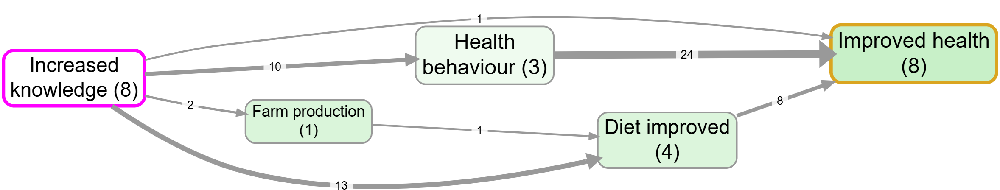
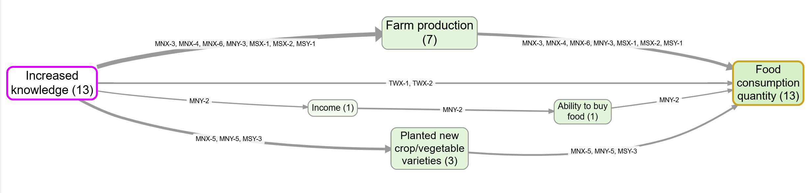

# {.center .title-page background-color="#1F1F36"}

::: {.headline}
How robust are your [causal pathways]{.teal}?
:::

::: {.subhead}
Crossing the Rubicon from a mass of claims to conclusions you can defend
:::

::: {.byline}
Causal Pathways Coffee Break · 16 June 2026 · Steve Powell & Gabriele Caldas Cabral, Causal Map Ltd
:::

## Welcome

::: {.lead}
A coffee break, so we will take this gently and step by step.
:::

Four things in the next half hour:

::: {.cards .cols-2}
::: {.card .teal}
What causal mapping is, in plain terms
:::
::: {.card .teal}
Two real examples: Love Alliance, and Jewlya Lynn's work
:::
::: {.card .teal}
The nine-step workflow, one step at a time
:::
::: {.card .yellow}
The real question: how do you make it rigorous?
:::
:::

::: {.notes}
Welcome, and thanks for giving us your coffee break. We will keep this gentle. Causal mapping, very simply, is a way to make sense of what people tell us causes what. You read interviews or reports, you code each causal claim as a link from one factor to another with the actual quote, and you combine many of them into a map. Nothing here needs a statistics background. What has changed is scale: AI now lets one project run to tens of thousands of claims, so we have to work harder, not less hard, to stay rigorous.
:::

## What is causal mapping?

::: {.lead}
A way to make sense of what people say causes what.
:::

::: {.cards .cols-3}
::: {.card .grey}
**Collect**

Interviews, focus groups, reports: wherever people explain why things changed.
:::
::: {.card .teal}
**Code**

Code each claim:

"The training raised her confidence" becomes a link from one factor to another, with the verbatim quote.
:::
::: {.card .yellow}
**Query**

Combine the links from many sources and you have a causal map.
:::
:::

## A causal map {.no-title background-image="../_shared/img/intrac-map-final.png" background-size="contain" background-color="#ffffff"}

::: {.shot-cap}
A network of what people believe drives what, built from many sources. Every arrow is backed by quotes you can read.
:::

## Why this matters even more now

::: {.lead}
AI lets a single project run to tens or hundreds of thousands of causal claims.
:::

So we have to try even harder to make sure our findings and conclusions are rigorous.

::: {.fragment .panel .teal}
The gap between "we have many claims" and "we have conclusions we can defend" is easy to underestimate. That gap is what today is about.
:::

## Where causal mapping belongs {.no-title background-image="../_shared/img/map-900-causal-mapping-the-evaluation-evidence-broker-broker.png" background-size="contain" background-color="#ffffff"}

::: {.shot-cap}
Causal mapping is an evidence broker. It gathers and organises causal claims so that the methods you already use can make the judgement: contribution analysis, process tracing, Outcome Harvesting, realist evaluation, QuIP, Most Significant Change. Most real evaluations combine several.
:::

## Causal mapping is not causal inference.

::: {.lead}
Twenty people, or twenty thousand, saying X influenced Y does not on its own prove that it did.
:::


::: {.fragment .panel .teal}
The app assembles the claims [so that you can make the judgement]{.flare .yellow}. It does not make the judgement for you. That is the preparatory step for almost any approach, especially theory-based ones like contribution analysis.
:::

## Crossing the Rubicon

::: {.lead}
From a mass of raw claims to a smaller set you can vouch for.
:::

::: {.cards .cols-3}
::: {.card .grey}
**Claims**

What sources said, each with its quote. Evidence, not yet weighed.
:::
::: {.card .teal}
**The crossing**

Your quality-assurance work: code, check, bundle, trace, judge.
:::
::: {.card .yellow}
**Conclusions**

A defensible answer, with every step on show.
:::
:::

::: {.fragment .caption}
The warranting is always yours. We provide the structures that make it easier, more transparent and more auditable.
:::

# Two real examples {.center .title-page background-color="#1F1F36"}

## Love Alliance: causal mapping at scale

::: {.lead}
A five-year partnership for the health and rights of key populations affected by HIV, across ten African countries.
:::

::: {.columns}
::: {.column width="55%"}
Southern Hemisphere led the end-term evaluation; we supported the causal-mapping strand.

AI did the low-level coding across [176 documents]{.hl .yellow}: over 22,000 causal claims, 13,756 kept for the maps, and [a quote on every link]{.hl .cyan}.

Code wide and cheap first, judge later. 

Maps at three scales, the ten countries, the regions and a global picture, and cut by theme.
:::
::: {.column width="45%"}
::: {.panel .teal .scale-75}
When a worry surfaced that the programme's own advocacy might be provoking a backlash, we put the question to the data and traced it through the sources, quote by quote. The evidence pointed the other way.
:::
:::
:::

::: {.notes}
Our first example is Love Alliance, an HIV and rights programme across ten African countries. Southern Hemisphere ran the end-term evaluation and we did the causal mapping. This one is about scale and deferred judgement. AI coded 176 documents into more than twenty-two thousand causal claims, every link with a verbatim quote, and we built maps for each country, each region and the whole programme. We did not judge as we coded; we captured everything cheaply and judged later. When someone worried the advocacy might be causing a backlash, we did not argue from impression, we filtered to that question and traced it through the individual sources, and the evidence consistently showed the support helping communities resist backlash rather than cause it. Jewlya's example next is the contrast: a formal rubric on the evidence at the point of judgement.
:::

## Jewlya's retrospective

::: {.lead}
A ten-year, systems-change retrospective, some of you saw her present it at April's Coffee Break.
:::

::: {.columns}
::: {.column width="55%"}
She coded [every single claim separately]{.hl .yellow}, each with its own quote.

Coterminal claims, the ones saying the same X influenced Y, were gathered into bundles.

Each bundle was scored against a [five-level rubric]{.hl .cyan}: over 350 causes and 150 connections, every one verified against the evidence.
:::
::: {.column width="45%"}
::: {.panel .teal}
The final map was displayed in Kumu, where each bundle shows as a single link. One clean arrow on the screen can stand for many separately coded claims underneath.
:::
:::
:::

::: {.notes}
Some of you saw Jewlya Lynn present in April. Her project is a good illustration. She coded every single claim separately, each with its own quote. Then the claims that say the same thing, the same X influences Y, were gathered into bundles, and each bundle was scored against a five-level rubric. When you see the final map in Kumu, every link looks simple, one clean arrow, but underneath each arrow is a whole bundle of separately coded, quoted claims. We are now going to walk her path, step by step.
:::

## Bundles shown as single links {.no-title background-image="../_shared/img/map-1130-causal-mapping-with-kumu-kumu.png" background-size="contain" background-color="#ffffff"}

::: {.shot-cap}
A map like this in Kumu. Each link looks simple, but behind it is a bundle of individually coded claims, each with its source and quote. We will now follow that same path, step by step.
:::

## Nine steps, three tasks {.nine-steps}

```{=html}
<style>.reveal .nine-steps .card .card{background:#fff;color:#1F1F36} .reveal .nine-steps .chip{background:#1F1F36;color:#fff}</style>
```

:::: {.columns}
::: {.column width="33%"}
::: {.card .grey}
**Collect**

::: {.cards style="grid-template-columns:1fr"}
::: {.card}
[1]{.chip} Start from the question
:::
::: {.card}
[2]{.chip} Gather the data
:::
:::
:::
:::
::: {.column width="33%"}
::: {.card .teal}
**Code**

::: {.cards style="grid-template-columns:1fr"}
::: {.card}
[3]{.chip} Manage the codebook
:::
::: {.card}
[4]{.chip} Code each claim
:::
::: {.card}
[5]{.chip} Check and tag
:::
:::
:::
:::
::: {.column width="34%"}
::: {.card .yellow}
**Query**

::: {.cards style="grid-template-columns:1fr"}
::: {.card}
[6]{.chip} From claims to bundles
:::
::: {.card}
[7]{.chip} From bundles to pathways
:::
::: {.card}
[8]{.chip} Value and alternatives
:::
::: {.card}
[9]{.chip} Holistic judgement
:::
:::
:::
:::
::::

::: {.fragment .caption}
A few wide, cheap passes to capture the evidence, then steadily narrower judgement. We will now walk all nine.
:::

::: {.notes}
Before we walk through it, here is the whole workflow on one slide: nine steps in three tasks. Collect, where you decide the question and gather data. Code, where you turn text into a checked table of claims, each with a quote. And Query, where you weigh the evidence and answer the question. Both examples you just saw run along these three tasks: Love Alliance shows the wide, cheap Collect and Code passes at scale, and Jewlya's retrospective shows the formal judgement in Query. Now we take them one at a time.
:::

# Collect {.center .title-page background-color="#1F1F36"}

## Step 1: start from the question

::: {.lead}
Write down what you want to be able to say at the end, and to whom.
:::

::: {.columns}
::: {.column width="50%"}
Good questions for the method:

- Which factors matter most
- What influences or follows from a factor
- How different groups see things
- How well the evidence supports a pathway or theory of change
:::
::: {.column width="50%"}
::: {.panel .pink}
It will not give you effect sizes, and on its own it does not prove X causes Y. Sketch the map that would answer your question; that sketch is your target.
:::
:::
:::

::: {.notes}
Two quick steps before any coding. Start from the question: write down what you want to say at the end and to whom, and sketch the map that would answer it. Be honest about what the method does well, which factors matter, how groups differ, how well evidence supports a pathway, and what it will not do, which is give you effect sizes. Then gather the data to match. Narrative material works best: ask people what changed and why. And make sure any groups you will want to compare are actually in the data.
:::


## Step 2: gather the data

::: {.lead}
The question decides the data.
:::

Narrative material works best: ask people what changed and why, and you get causal claims to code. QuIP-style "stories of change" are gathered in exactly this way.

::: {.fragment .panel .teal}
If you will want to compare women and men, or staff and clients, or early and late, those groups have to be in the data and recorded, so the comparisons are possible later.
:::

# Code {.center .title-page background-color="#1F1F36"}

## Step 3: the codebook

::: {.lead}
How tightly are the labels fixed in advance?
:::

::: {.cards .cols-2}
::: {.card .grey}
**Free**

Start from nothing and let the source's own terms emerge. Finds more, leaves more to tidy.
:::
::: {.card .grey}
**Fixed**

Start from a set codebook, such as a theory of change. Cleaner, but misses links.
:::
:::

::: {.fragment .caption}
Most projects are somewhere between, and you revise as you go.
:::

::: {.fragment .panel .yellow}
**QA** · Are the labels consistent and at the right grain? Whose world view do they encode?
:::

::: {.notes}
Now we turn text into claims. First the codebook: do you free-code and let people's own terms emerge, or start from a fixed frame like a theory of change. Most projects are in between. Then you code each claim as one link with its source and, this is the rule you never break, a verbatim quote for every single link. No quote, no working, no defensible conclusion. Finally you check and tag: flag anything doubtful or surprising so you can filter it later. One caution: conviction and strength are not one-two-three scores, and unmarked means not mentioned, not medium.
:::

## Step 4: code each claim {.no-title background-image="../_shared/img/map-the-first-two-columns-of-the-statements-tab.png" background-size="contain" background-color="#ffffff"}

::: {.shot-cap}
Each causal claim becomes one row: a link from one factor to another, with its source and a verbatim quote. By hand or with AI, the unit is the same.
:::

## We code claims, not facts

::: {.panel .teal}
A coded link means: *there is evidence that this source claims X influenced Y.*
:::

::: {.fragment}
Not that X really did influence Y. Twenty people saying so is not proof. It is evidence you can now weigh. Crossing from claims to conclusions is your job, and the back half of this workflow is about doing it well.
:::

## The one rule you never break

::: {.bignum}
::: {.fig}
1
:::
::: {.bn-body}
verbatim quote for every single link, no exceptions.
:::
:::

::: {.fragment .panel .pink}
Without it you are no longer showing your working, and you cannot justify the conclusions you draw. The app does not enforce this, so you have to.
:::

::: {.fragment .panel .yellow}
**QA** · Two coding targets: precision (are the links right?) and recall (did you miss any?). Tune the instruction on a small, varied sample until both hold.
:::

## Step 5: check and tag {.no-title background-image="../_shared/img/map-link-tags-on-map.png" background-size="contain" background-color="#ffffff"}

::: {.shot-cap}
Some links will be wrong, so check them. Tag a doubtful or surprising claim (#doubtful, #surprising) so you can filter it in or out later.
:::

::: {.fragment .panel .yellow}
**QA** · Conviction codes how sure the *source* sounds, not how strong the link is. And unmarked means not mentioned, not medium.
:::

# Query {.center .title-page background-color="#1F1F36"}

## Step 6: from claims to bundles

::: {.lead}
The core quality-assurance move, and the answer to question one: how do you interrogate a mass of evidence?
:::

A bundle is every claim that says the same X influenced Y. Weigh each one: how many sources, how convincing, do they agree or pull apart?

::: {.fragment .panel .teal}
You can record the verdict by collapsing a bundle into a single assessed link carrying your quality score. The app will not let you, by hand or with AI, until you have written your criteria into a rubric first, on purpose. Jewlya used a five-level scale.
:::

::: {.fragment .panel .yellow}
**QA** · Write the rubric before you judge. Plausibility, uniqueness and triangulation are a usable set of criteria.
:::

::: {.notes}
This is where judgement happens. Step six is the core move and answers question one: gather each bundle and weigh it. How many sources, how convincing, do they agree. You can collapse a bundle into one assessed link, but only after you write your rubric down first. A project might go from a thousand raw claims to thirty bundles to twenty-five assessed links. Step seven is the big trap: A to B from one person and B to C from another is not a story anyone told. Source tracing is the safe move, keeping only sources whose own account runs the whole way. Step eight compares your pathway against rivals on the same map. Step nine is the final human judgement, where the AI vignette can check each pathway is one coherent story.
:::

## Jewlya's actual rubric {.no-title background-image="../_shared/img/jewlya-strength-of-evidence-rubric.png" background-size="contain" background-color="#ffffff"}

::: {.shot-cap}
The five-level scale from Jewlya Lynn's retrospective. A finding had to reach at least Level 3, multiple sources from distinct perspectives, to be included. The criteria are written down first, then every bundle is judged against them.
:::

## From a mass of claims to a set you vouch for

::: {.bignum}
::: {.fig}
1000
:::
::: {.bn-body}
raw claims
:::
:::

::: {.bignum .fragment}
::: {.fig}
30
:::
::: {.bn-body}
bundles
:::
:::

::: {.bignum .fragment}
::: {.fig}
25
:::
::: {.bn-body}
assessed links: a much cleaner basis for argument
:::
:::

## Step 7: from bundles to pathways

::: {.lead}
The transitivity trap, and the answer to question three: how do you compare alternative explanations across a pathway?
:::

::: {.columns}
::: {.column width="55%"}
A pig farmer says:

> the cash grant gave me [more cash]{.hl .cyan}

A wheat farmer says:

> [more cash]{.hl .cyan} let me buy [more seed]{.hl .yellow}
:::
::: {.column width="45%"}
::: {.fragment .panel .pink .scale-75}
So cash grants lead to more seed?

No. One source said A to B, another said B to C. Stitched into one story A to B to C that nobody actually told.
:::
:::
:::

::: {.fragment .caption}
The single most important pitfall of any causal diagram.
:::

::: {.fragment .panel .yellow}
**QA** · A pathway is only as warranted as the within-source stories that run end to end.
:::

## Path tracing alone will not save you

{width="90%"}

{width="90%"}

::: {.shot-cap}
Path tracing shows every link on a route between two factors, across all sources. Easy to misread as a story someone actually told.

:::

## Source tracing keeps you safe {.no-title background-image="../_shared/img/map-upstream-influences-on-wellbeing-with-source-tracing.png" background-size="contain" background-color="#ffffff"}

::: {.shot-cap}
The conservative move: keep only sources whose own account runs all the way from A to C. Every link is then part of at least one complete story told by one person, and you can review the evidence source by source.
:::

## Step 8: value and alternatives

::: {.lead}
How much did it matter, and compared to what?
:::

Judging value and relative contribution is central evaluation territory, covered extensively by John Mayne and others. We lean on QuIP for value.

::: {.fragment .panel .teal}
The discipline: compare the influence you care about against rival explanations on the same map, not in isolation. Count the sources whose narratives actually run from your driver to your outcome.
:::

## Step 9: holistic judgement

::: {.lead}
Finally you draw the conclusion. This is the answer to question two: which weak or doubtful claims still hold up when you look at everything together.
:::

Behind a single tidy map there may be hundreds of quotes. Does the overall claim hold? Do the links in every pathway really belong to the same context?

::: {.fragment .panel .teal}
The AI vignette can take exactly these questions: is each link part of a coherent, complete story from source factor to target factor? It does only what a patient reader could, so treat its draft as a starting point and edit it.
:::

# So how do you make it rigorous? {.center .title-page background-color="#1F1F36"}

## It overlaps with what you already do

::: {.lead}
The whole field takes one question seriously: how do you assess the strength of evidence behind a causal claim?
:::

::: {.cards .cols-3}
::: {.card .blue}
**Built-in tests**

Process tracing weighs each link with hoop and smoking-gun tests.
:::
::: {.card .green}
**Built-in story**

Contribution analysis builds and tests a contribution story.
:::
::: {.card .yellow}
**Written rubric**

Where no test is built in, a rubric agreed in advance does the same job.
:::
:::

::: {.fragment}
Our bundle rubric in Step 6 is exactly this device, like the CLARISSA and Jewlya Lynn seafood-retrospective rubrics. A workable set of rubric criteria: plausibility, uniqueness, triangulation. None of these removes the final judgement; they make it transparent.
:::

::: {.notes}
So, rigour. The good news is this overlaps with what you already do. Process tracing weighs each link with hoop and smoking-gun tests. Contribution analysis builds and tests a contribution story. And where a method has no test built in, a rubric agreed in advance does the same job, like the CLARISSA rubrics or Jewlya's, judged on plausibility, uniqueness and triangulation. None of these removes the final judgement; they make it transparent. That is the whole stance: we organise the evidence and make it auditable, you warrant it. It is not causal inference, it is a disciplined way to reach conclusions you can defend. We do this every day in our consultancy, and we would love you to come on the journey. Thank you.
:::

## Causal mapping organises the evidence, you warrant it

::: {.lead}
At no point does the causal mapping move on its own from claims to facts.
:::

::: {.columns}
::: {.column width="50%"}
::: {.panel .teal}
**What it provides**

Tags, columns, the assessed-link switch, source tracing, vignettes: structures that make warranting easier and auditable.
:::
:::
::: {.column width="50%"}
::: {.panel .pink}
**What it does not provide**

An engine that turns "twenty people said so" into "therefore it is so".
:::
:::
:::

## None of this is causal inference

::: {.lead}
Not in a statistical sense. It is a disciplined way to assemble evidence, weigh it transparently, and reach conclusions you can defend.
:::

::: {.fragment .panel .teal}
We use this every day in our consultancy at Causal Map Ltd, and it keeps evolving. If you want to go on this journey with us, get in touch.
:::

::: {.caption}
Companion working papers in the Causal Map Garden: "A workflow for causal coding" and "Quality assurance at each step". App: app.causalmap.app
:::
